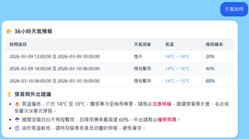
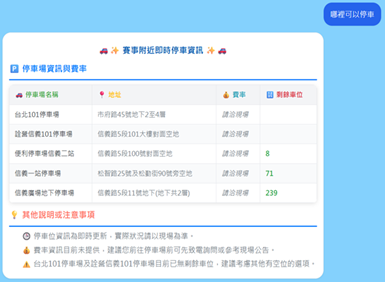
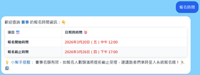

# jekoo

# 修改過程紀錄
## 2026-03-16

### 新增logo

**html**:

```html
<a href="#" class="logo">
    
    捷庫智能 <span>Jekoo AI</span>
</a>
```
說明：
1.src="images/Jekoo_logo.png" 就是圖片的路徑；alt 是當圖片萬一破圖顯示不出來時，會出現的替代文字，目前沒有設定

**css**:

```css
/* 讓 Logo 區塊變成彈性盒子，讓圖片跟文字完美橫排並置中 */
.logo {
    display: flex;
    align-items: center; /* 垂直置中對齊 */
    gap: 10px; /* 圖片跟文字之間空出 10px 的安全距離 */
    font-size: 1.5rem;
    font-weight: 900;
    color: var(--primary-blue);
}

/* 限制圖片的大小 */
.logo-img {
    height: 35px; /* 限制高度，你可以根據導覽列的高度自己微調這個數字 */
    width: auto;  /* 寬度設定 auto，圖片才不會變形 */
}
```
說明:
1.因為現在 Logo 這個區塊裡面同時塞了「圖片」和「文字」，如果沒有調整，它們可能會一上一下對不齊，或是圖片太大把導覽列撐破。

### 修改hero的背景

**css**:

```css
/* 首圖區 Hero */
.hero {
    /* 保持原本的 Flexbox 與高度設定 */
    height: 100vh;
    min-height: 600px;
    display: flex;
    align-items: center;
    justify-content: center;
    text-align: center;
    color: var(--white);
    padding: 0 20px;

    /* --- 新增的背景圖片設定 --- */
    
    /* 先疊一層 40% 不透明度的黑色，再疊圖片 */
    background-image: linear-gradient(rgba(0, 0, 0, 0.4), rgba(0, 0, 0, 0.4)), url('images/hero_bg.png');
    
    /* 2. 關鍵設定：讓圖片完美鋪滿整個區塊，且不變形 */
    background-size: cover;
    
    /* 3. 關鍵設定：讓圖片置中對齊，即使螢幕比例不同也不會跑版 */
    background-position: center;
    
    /* 4. 防止圖片重複鋪排 (當圖片太小時) */
    background-repeat: no-repeat;
    
    /* 5. 保險設定：設定一個備用背景色（防止圖片載入失敗時一片白，導致白色文字看不到） */
    background-color: var(--primary-blue);
}
```
說明:
1.改成圖片背景後，原本白色的文字可能會因為圖片顏色變得很雜亂而變得很難讀清楚，所以background-image有40%不透明度

### 在hero 和 solutions section 之間新增使用案例圖片

**html**:

```html
<section class="gallery-section" id="gallery">
    <div class="container">
        <h2 class="section-title fade-in">功能展示</h2>
        <p class="section-subtitle text-center fade-in">完整呈現資訊，滿足您的需求</p>
        
        <div class="gallery-grid">
            <div class="gallery-item fade-in">
                <div class="img-wrapper">
                    
                </div>
                <div class="item-info">
                    <h3><i class="fas fa-cloud-sun"></i> 即時天氣預報</h3>
                    <p>完整提供 36 小時天氣狀況、氣溫與穿著建議。</p>
                </div>
            </div>

            <div class="gallery-item fade-in">
                <div class="img-wrapper">
                    
                </div>
                <div class="item-info">
                    <h3><i class="fas fa-phone-alt"></i> 賽事相關聯絡</h3>
                    <p>列出重要協會與合作飯店的電話及網站連結。</p>
                </div>
            </div>

            <div class="gallery-item fade-in">
                <div class="img-wrapper">
                    
                </div>
                <div class="item-info">
                    <h3><i class="fas fa-parking"></i> 即時停車資訊</h3>
                    <p>一覽附近停車場的地址、費率及剩餘車位數。</p>
                </div>
            </div>

            <div class="gallery-item fade-in">
                <div class="img-wrapper">
                    
                </div>
                <div class="item-info">
                    <h3><i class="fas fa-calendar-check"></i> 賽事報名時間</h3>
                    <p>清晰標明開始與截止時間，提醒您額滿為止。</p>
                </div>
            </div>
        </div>
    </div>
</section>
```
說明:

**css**:

```css
/* --- 功能圖片展示格 (Gallery) --- */
.gallery-section {
    padding: 80px 0;
    background: var(--bg-light);
}

.section-subtitle {
    margin-bottom: 50px;
    color: var(--text-dark);
    opacity: 0.8;
}

/* 建立一個 2x2 的網格，並在中間空出間距 */
.gallery-grid {
    display: grid;
    grid-template-columns: repeat(2, 1fr); /* 核心魔法 1：分成兩欄 */
    gap: 40px; /* 卡片之間的距離 */
}

/* 每一張卡片的設定 */
.gallery-item {
    background: var(--white);
    border-radius: 12px;
    box-shadow: var(--shadow-sm);
    overflow: hidden; /* 確保內容不會超出卡片 */
    transition: var(--transition);
}

.gallery-item:hover {
    transform: translateY(-5px); /* 滑鼠移上去時微微浮起 */
    box-shadow: var(--shadow-md);
}

/* 圖片的收納盒 (藍紫色區塊) */
.img-wrapper {
    padding: 20px;
    background: #E8F0FF; 
    display: flex;
    justify-content: center;
    align-items: center;
    
    /* 核心修改：把 min-height 改成絕對固定的 height */
    height: 280px; /* 這個數字你可以根據截圖的實際感覺微調 (例如 250px 或 300px) */
}

/* 完美顯現全圖的核心設定 */
.full-img {
    /* 核心修改：強制圖片的寬高最高只能等於藍紫色框框 (扣掉 padding 後) 的大小 */
    width: 100%;
    height: 100%; 
    
    /* object-fit: contain 會讓圖片在不變形、不裁切的情況下，盡可能放大到碰到框框邊緣為止 */
    object-fit: contain; 
    display: block;
}

/* 圖片下方的文字說明 */
.item-info {
    padding: 25px;
}

.item-info h3 {
    font-size: 1.3rem;
    color: var(--primary-blue);
    margin-bottom: 10px;
}

.item-info h3 i {
    margin-right: 8px; /* 圖示跟文字之間空一點 */
    color: var(--accent-blue);
}

.item-info p {
    font-size: 1rem;
    color: var(--text-dark);
    line-height: 1.6;
}

/*  手機版 RWD 排版：寬度不足時，改成一欄 */
@media (max-width: 768px) {
    .gallery-grid {
        grid-template-columns: 1fr; /* 改成直排一欄 */
    }
}
```
說明:
1.(height: 280px)：我們直接下達死命令，不管圖片多高多矮，藍紫色的框框就是剛好 280px 高。這樣一來，所有的卡片就都會長得一模一樣高了！
2.(width: 100%, height: 100%)：這告訴圖片「你的極限就是這個藍紫色的空間」。
3.(object-fit: contain)：這是最聰明的屬性。它會幫你計算：如果圖片太寬，就左右貼齊，上下自動留出藍紫色的縫隙；如果圖片太高，就上下貼齊，左右留縫隙。絕對不變形、絕對不裁切！